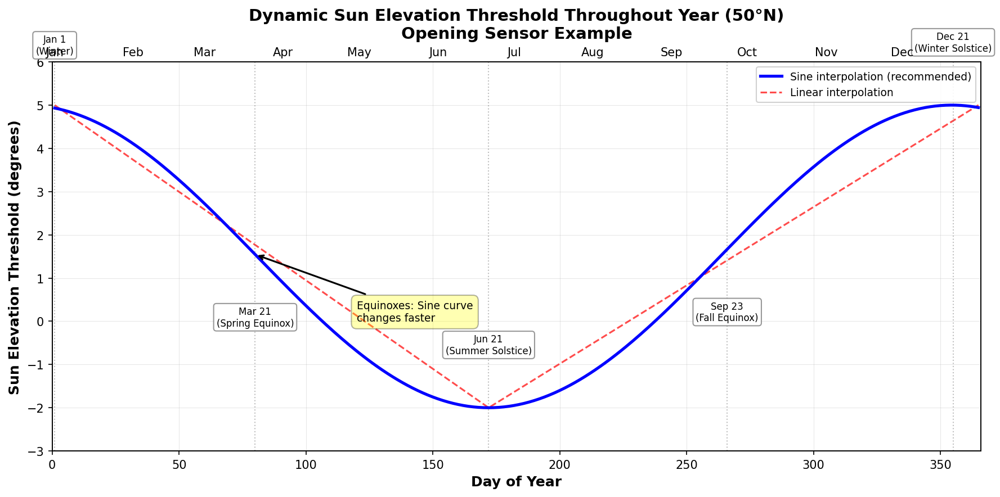
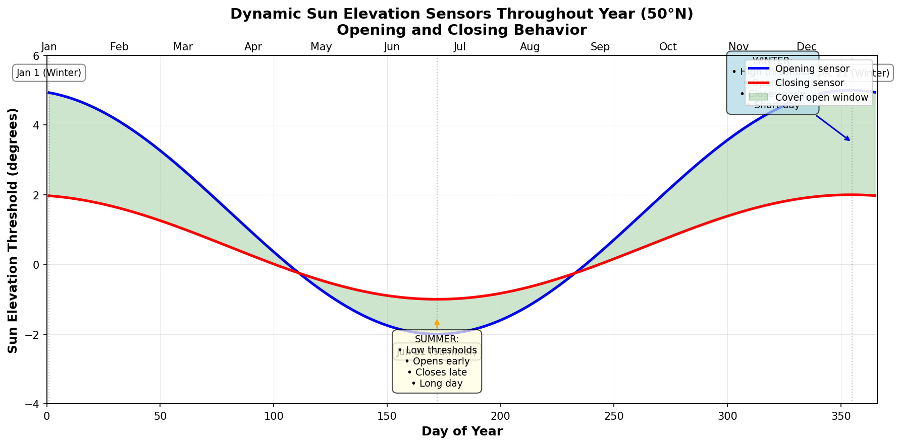
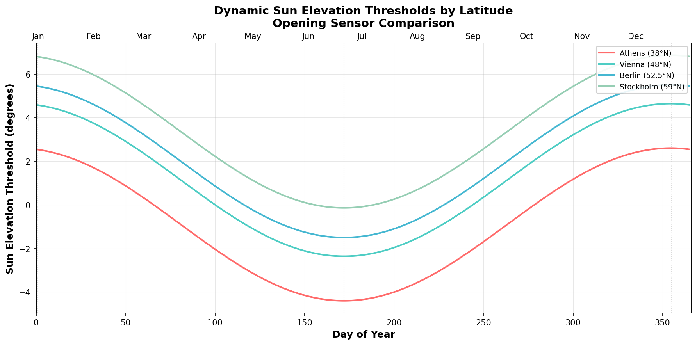
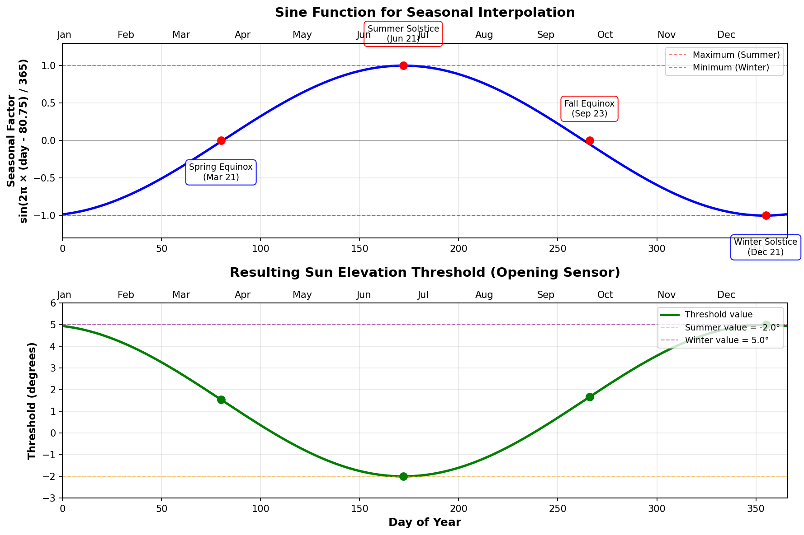

# Dynamic Sun Elevation Configuration

## 🌍 The Problem

Fixed sun elevation thresholds don't work optimally throughout the year due to Earth's axial tilt and orbital motion:

**Winter Issues:**
- Sun reaches lower maximum elevation
- Fixed summer thresholds may never trigger
- Covers stay closed too long

**Summer Issues:**
- Sun reaches higher maximum elevation  
- Fixed winter thresholds trigger too early
- Covers open/close at wrong times

**Daylight Saving Time:**
- Clock shifts by 1 hour
- Sun position unchanged
- Manual threshold adjustments needed twice per year

## ✨ The Solution

**Template sensors with sinusoidal interpolation** automatically adapt thresholds based on the current date, matching the Earth's actual solar cycle.

### How the Sensors Work

The sensors provide **dynamic threshold values** that change throughout the year:

- **Opening Sensor**: Provides the minimum sun elevation required for opening
  - Cover opens when current sun elevation **rises above** this threshold
  - Higher values = later opening (sun must climb higher)

- **Closing Sensor**: Provides the maximum sun elevation allowed before closing
  - Cover closes when current sun elevation **falls below** this threshold
  - Higher values = later closing (sun can set further)

**Example scenario (Berlin, 52°N):**
- Summer solstice (June 21): Opening sensor = -1.6°, Closing sensor = -0.6°
- Winter solstice (Dec 21): Opening sensor = 5.4°, Closing sensor = 2.4°
- Result: Covers open earlier and close later in summer (long day), open later and close earlier in winter (short day)

### Visual Comparison



The graph above shows how the dynamic sun elevation threshold changes throughout the year, comparing sinusoidal interpolation (recommended) with linear interpolation.

<details>
<summary>ASCII version (click to expand)</summary>

```
Sun Elevation Threshold Throughout Year (50°N)

  6° ┤╲                                          ╱
     │ ╲                                        ╱
  4° ┤  ╲       ╲─────────────────────────╱   ╱
     │   ╲       ╲                       ╱   ╱
  2° ┤    ╲       ╲   ← Spring/Autumn:  ╱   ╱  Linear
     │     ╲       ╲     Sine changes   ╱  ╱─╲
  0° ┤      ╲       ╲    faster!       ╱ ╱    ╲
     │       ╲       ╲                ╱╱       ╲
 -2° ┤        ╲       ╰─Sine curve─╯╱          ╲
     │         ╲                   ╱            ╲
 -4° ┼──┬────┬──┴─────────────────┴────┬────┬───
     Jan    Mar  May  Jul  Sep  Nov  Jan
            ↑                    ↑
        Equinox              Equinox
        (faster)             (faster)

        Solstice →  Jun/Dec  ← Solstice
                    (slower)
```
</details>

**Why Sine is Better:**
- 📈 **Physically accurate** - matches Earth's declination cycle
- 🔄 **Smooth transitions** - no abrupt changes at solstices
- ⚡ **Realistic speed** - faster changes in spring/autumn, slower in summer/winter
- 💯 **More accurate** - ±0.5° vs ±1° with linear interpolation

---

## 🚀 Quick Setup (5 Minutes)

### Step 1: Add Template Sensors

Add this to your `configuration.yaml` or create a new file in `packages/`:
```yaml
template:
  - trigger:
      - trigger: time
        at: "00:01:00"
      - platform: event
        event_type:
          - homeassistant_started
    sensor:
      # ========================================
      # Dynamic Sun Elevation - Opening
      # ========================================
      - name: "Sun Elevation Up Dynamic"
        unique_id: sun_elevation_up_dynamic
        unit_of_measurement: "°"
        icon: mdi:weather-sunset-up
        state: >
          
          

          {# Reference values for 50°N #}
          
          

          {# Sinusoidal interpolation (physically correct) #}
          {# Day 80.75 ≈ March 21 (spring equinox) as reference #}
          
          

          {# Latitude adjustment: ±0.2° per degree from 50°N #}
          
          

          {{ final | round(1) }}

      # ========================================
      # Dynamic Sun Elevation - Closing
      # ========================================
      - name: "Sun Elevation Down Dynamic"
        unique_id: sun_elevation_down_dynamic
        unit_of_measurement: "°"
        icon: mdi:weather-sunset-down
        state: >
          
          

          {# Reference values for 50°N #}
          
          

          {# Sinusoidal interpolation (physically correct) #}
          
          

          {# Latitude adjustment #}
          
          

          {{ final | round(1) }}
```

### Step 2: Restart Home Assistant

**Settings** → **System** → **Restart**

### Step 3: Verify Sensors

**Developer Tools** → **States** → Search for:
- `sensor.sun_elevation_up_dynamic`
- `sensor.sun_elevation_down_dynamic`

Both should show numeric values (e.g., `2.3`)

### Step 4: Configure CCA Blueprint

In your CCA automation configuration:

1. Navigate to **Sun Elevation Settings** section
2. Find the new **Dynamic Sensor** fields:
   - **☀️ Sun Elevation Up Sensor (Dynamic)**: Select `sensor.sun_elevation_up_dynamic`
   - **☀️ Sun Elevation Down Sensor (Dynamic)**: Select `sensor.sun_elevation_down_dynamic`
3. Save automation

**Done! 🎉** Your covers now adapt automatically to seasons.

---

## ⚠️ Common Mistake: Inverted Values

**CRITICAL: Make sure your `summer` and `winter` values are NOT inverted!**

Many users initially configure these values backwards. Here's how to verify you have them correct:

### ✅ Correct Configuration

**Opening sensor (Sun Elevation Up Dynamic):**
```yaml
  # ✅ LOWER value for summer (opens EARLIER)
   # ✅ HIGHER value for winter (opens LATER)
```

**Closing sensor (Sun Elevation Down Dynamic):**
```yaml
  # ✅ LOWER value for summer (closes LATER)
   # ✅ HIGHER value for winter (closes EARLIER)
```

### ❌ Common Mistake (INVERTED)

**If you have this, it's WRONG:**
```yaml
# Opening sensor - INVERTED (WRONG!)
   # ❌ Summer value HIGHER than winter
  # ❌ Winter value LOWER than summer

# Closing sensor - INVERTED (WRONG!)
   # ❌ Summer value HIGHER than winter
  # ❌ Winter value LOWER than summer
```

### 🧪 Quick Test

After setting up your sensors, verify the values in Developer Tools:

**In Summer (June-July):**
- Opening sensor should show **NEGATIVE** or **LOW** values (e.g., -1.5° to 0°)
- Closing sensor should show **NEGATIVE** or **LOW** values (e.g., -0.5° to 1°)

**In Winter (December-January):**
- Opening sensor should show **POSITIVE** and **HIGH** values (e.g., 4° to 6°)
- Closing sensor should show **POSITIVE** values (e.g., 1.5° to 3°)

**If your values are the opposite, your configuration is INVERTED!**

### 🎯 Remember the Logic

- **Opening**: Cover opens when `sun elevation > threshold`
  - Lower threshold = Opens earlier (summer behavior)
  - Higher threshold = Opens later (winter behavior)

- **Closing**: Cover closes when `sun elevation < threshold`
  - Lower threshold = Closes later (summer behavior)
  - Higher threshold = Closes earlier (winter behavior)

---

## 📊 How It Works



The graph above visualizes how both opening and closing sensors work together throughout the year, creating different "open window" durations in summer vs winter.

### Understanding the Comparison Logic

The dynamic sensors provide **threshold values** that are compared with the **current sun elevation**:

**Opening Logic (Sun Elevation Up):**
- ✅ Cover **opens** when: `current sun elevation > sensor value`
- 📈 **Example**: Sensor = 2.5° → Cover opens when sun rises **above** 2.5°
- 🔄 **Seasonal behavior**:
  - Summer (sensor = -2.0°): Opens earlier (sun can be below horizon)
  - Winter (sensor = 5.0°): Opens later (sun must climb higher)

**Closing Logic (Sun Elevation Down):**
- ✅ Cover **closes** when: `current sun elevation < sensor value`
- 📉 **Example**: Sensor = 0.5° → Cover closes when sun sets **below** 0.5°
- 🔄 **Seasonal behavior**:
  - Summer (sensor = -1.0°): Closes later (sun can drop below horizon)
  - Winter (sensor = 2.0°): Closes earlier (closes before sunset)

### Automatic Features

✅ **Reads your latitude** from `zone.home` automatically
✅ **Calculates optimal thresholds** for your location
✅ **Interpolates smoothly** between summer and winter values
✅ **Updates daily** to follow sun's annual path
✅ **No maintenance** required after initial setup

### Reference Values

The sensors use these baseline values for **50°N latitude** (Central Europe):

| Sensor | Summer (Jun 21) | Winter (Dec 21) | Range |
|--------|-----------------|-----------------|-------|
| **Opening** | -2.0° | 5.0° | 7.0° span |
| **Closing** | -1.0° | 2.0° | 3.0° span |

**Automatic latitude adjustment:** ±0.2° per degree difference from 50°N

### Values at Different Latitudes



The graph above shows how the opening sensor thresholds automatically adjust for different latitudes across Europe.

| Location | Latitude | Opening Summer | Opening Winter |
|----------|----------|----------------|----------------|
| **Tromsø** 🇳🇴 | 69.6°N | 1.9° | 8.9° |
| **Stockholm** 🇸🇪 | 59.3°N | -0.1° | 6.9° |
| **Copenhagen** 🇩🇰 | 55.7°N | -0.9° | 6.1° |
| **Berlin** 🇩🇪 | 52.5°N | -1.5° | 5.5° |
| **London** 🇬🇧 | 51.5°N | -1.7° | 5.3° |
| **Paris** 🇫🇷 | 48.9°N | -2.2° | 4.8° |
| **Vienna** 🇦🇹 | 48.2°N | -2.4° | 4.6° |
| **Milan** 🇮🇹 | 45.5°N | -3.1° | 3.9° |
| **Rome** 🇮🇹 | 41.9°N | -3.8° | 3.2° |
| **Athens** 🇬🇷 | 38.0°N | -4.6° | 2.4° |

---

## 🔧 Customization

### When to Customize

**You probably DON'T need to customize if:**
- ✅ You live between 40°N and 60°N
- ✅ You want covers to open around sunrise
- ✅ You want covers to close around sunset

**You SHOULD customize if:**
- ❌ Covers open too early or too late
- ❌ You want specific opening times regardless of sunrise
- ❌ Your latitude is outside 40-60°N range

### Method 1: Adjust Reference Values (Recommended)

Modify the `summer` and `winter` values to shift timing:
```yaml
{# Original values #}



{# Open earlier in morning #}
   # Lower value = earlier opening


{# Open later in morning #}
   # Higher value = later opening

```

**Rule of thumb:** Each 1° change shifts timing by approximately 4-6 minutes.

### Method 2: Adjust Latitude Factor (Advanced)

Change latitude sensitivity by modifying the `0.2` multiplier:
```yaml
{# Standard (recommended) #}


{# More aggressive latitude adjustment #}


{# Less aggressive latitude adjustment #}

```

### Method 3: Different Summer/Winter Ratios

Create asymmetric behavior:
```yaml
{# Aggressive summer (very early), conservative winter #}



{# Conservative summer, aggressive winter (very late) #}


```

---

## 🎯 Examples by Use Case

### Early Bird Setup (Opens Early)
```yaml
# Opening sensor
  # Was: -2.0
   # Was: 5.0

# Closing sensor
  # Was: -1.0
   # Was: 2.0
```

**Effect:** Covers open ~30 min earlier, close ~30 min earlier

### Night Owl Setup (Opens Late)
```yaml
# Opening sensor
   # Was: -2.0
   # Was: 5.0

# Closing sensor
   # Was: -1.0
   # Was: 2.0
```

**Effect:** Covers open ~30 min later, close ~30 min later

### Maximum Privacy (Stays Closed Longer)
```yaml
# Opening sensor - very late



# Closing sensor - very early


```

**Effect:** Minimum exposure time, maximum privacy

### Energy Saving (Solar Heat Gain)
```yaml
# Opening sensor - early to capture morning sun



# Closing sensor - late to keep warmth inside


```

**Effect:** Opens early (solar gain), closes late (heat retention)

---

## 📐 Mathematical Background



The diagram above shows how the sine function transforms the seasonal cycle into smooth threshold values.

### The Sine Formula
```
elevation = winter + (summer - winter) × (sin(2π × (day - 80.75) / 365) + 1) / 2
```

### Why Day 80.75?

**Day 80.75 ≈ March 21** (Spring Equinox)

This is the **reference point** where:
- ☀️ Sun crosses celestial equator (declination = 0°)
- ⚖️ Day and night are equal length worldwide
- 🌍 Perfect starting point for sinusoidal model

### Key Dates in Solar Cycle
```
        Dec 21 (Day 355)           Jan 1
      MAXIMUM THRESHOLD        MAXIMUM THRESHOLD
              ╲╱                      ╲╱
            ╱  ╲                    ╱  ╲
          ╱      ╲                ╱      ╲
        ╱          ╲            ╱          ╲
     ╱              ╲        ╱              ╲
Mar 21                ╲    ╱                Sep 23
(Day 80)               ╲  ╱                 (Day 266)
EQUINOX                 ╲╱                  EQUINOX
                        ╱╲
                      ╱    ╲
                    ╱        ╲
                  ╱            ╲
                ╱                ╲
              ╱                    ╲
            ╱                        ╲
          ╱                            ╲
        Jun 21 (Day 172)
     MINIMUM THRESHOLD

Note: For threshold values with summer < winter,
      the sine curve is inverted compared to sun's declination
```

### Step-by-Step Calculation

Example: **September 20** (Day 263), **52°N** (Berlin), **Opening sensor**
```yaml
# 1. Get inputs
day = 263
lat = 52.0
summer = -2.0
winter = 5.0

# 2. Calculate seasonal factor
days_from_equinox = 263 - 80.75 = 182.25
radians = 2 × π × 182.25 / 365 = 3.14 rad
sin_value = sin(3.14) ≈ 0.00
seasonal_factor = 0.00

# 3. Calculate base elevation
base = 5.0 + (-2.0 - 5.0) × (0.00 + 1) / 2
base = 5.0 + (-7.0) × 0.5
base = 1.5°

# 4. Apply latitude adjustment
adjustment = (52.0 - 50.0) × 0.2 = 0.4°
final = 1.5 + 0.4 = 1.9°

# Result: Threshold = 1.9° (halfway between summer and winter)
```

### Sine Function Properties
```
Value Range: -1 to +1

         1.0 ┤     ╭───╮
             │   ╱       ╲
         0.5 ┤ ╱           ╲
             │╱             ╲
         0.0 ┼               ╲     ╱
             │                ╲   ╱
        -0.5 ┤                 ╲ ╱
             │                  ╰
        -1.0 ┤
             └─┬───┬───┬───┬───┬─
              0   π/2  π  3π/2 2π
           (Day 80) (172) (266) (355)
```

**Transformation to 0-1 range:**
```
normalized = (sin_value + 1) / 2
```

This ensures smooth interpolation between winter (0) and summer (1) values.

---

## 🧪 Testing & Verification

### Check Current Values

**Developer Tools** → **Template** → Test this:
```yaml
{{ states('sensor.sun_elevation_up_dynamic') }}
{{ states('sensor.sun_elevation_down_dynamic') }}
```

Should return numbers like: `2.3` and `0.1`

### Verify Seasonal Changes

Check values at different dates:
```yaml
{# Current date #}
{{ states('sensor.sun_elevation_up_dynamic') }}

{# Simulate summer (Day 172) #}







{{ (base + adjustment) | round(1) }}
{# Should be close to -2.0° #}

{# Simulate winter (Day 355) #}

{# ... same calculation ... #}
{# Should be close to 5.0° (or adjusted for your latitude) #}
```

### Test with Automation

Enable **Automation Traces** to verify sensor usage:

1. **Developer Tools** → **States** → Find your CCA automation
2. Click **⋮** menu → **Traces**
3. Look for trigger `t_open_5` or `t_close_5`
4. Check `value_template` shows sensor value

---

## 🐛 Troubleshooting

### Sensor shows "unknown" or "unavailable"

**Cause:** Template syntax error or missing `zone.home`

**Solution:**
1. Check Configuration → Logs for template errors
2. Verify `zone.home` exists in Developer Tools → States
3. Check latitude is valid: `{{ state_attr('zone.home', 'latitude') }}`

### Values seem incorrect

**Cause:** Default values don't match your preferences

**Solution:** Adjust summer/winter reference values (see Customization)

### Covers open/close at wrong times

**Diagnosis table:**

| Problem | Current Threshold | Action |
|---------|-------------------|--------|
| Opens too **early** | Too low (e.g., -3°) | **Increase** summer/winter values |
| Opens too **late** | Too high (e.g., +8°) | **Decrease** summer/winter values |
| Closes too **early** | Too high (e.g., +5°) | **Decrease** summer/winter values |
| Closes too **late** | Too low (e.g., -6°) | **Increase** summer/winter values |

### Automation not using sensors

**Check:**
1. ✅ Sensors exist and show numeric values
2. ✅ CCA automation configured with sensor entities
3. ✅ CCA version supports dynamic sensors (2025.XX.XX+)
4. ✅ Fixed values in CCA are **not** set to same values as sensors

### Sensors not updating

**Normal behavior:** Sensors update when:
- Home Assistant restarts
- Template system recalculates (periodic)
- Manual automation reload

**Not needed:** Sensors don't need to update more than once per day - daily changes are gradual.

---

## 🌐 Regional Adaptations

### Northern Europe (55-70°N)

Extreme seasonal variation requires wider range:
```yaml
# Opening sensor
  # Much lower minimum
   # Much higher maximum

# Closing sensor


```

### Mediterranean (35-45°N)

Less variation, higher year-round sun:
```yaml
# Opening sensor
  # Lower baseline
   # Higher baseline

# Closing sensor


```

### Southern Hemisphere

**Invert the seasons** by adding 182.5 days (6 months):
```yaml

```

This shifts the curve so:
- Maximum in December (summer)
- Minimum in June (winter)

---

## 📚 Advanced Topics

### Non-Linear Latitude Adjustment

For extreme latitudes, use quadratic adjustment:
```yaml


```

This increases sensitivity at higher/lower latitudes.

### Monthly Lookup Tables

For maximum control, use discrete monthly values:
```yaml


{{ monthly_values[month] }}
```

### Hysteresis Integration

Add hysteresis to prevent rapid oscillation:
```yaml
# In CCA configuration
Sun Elevation Up: 5.0°
Brightness Hysteresis: 1000 lx  # Add this for stability
```

Hysteresis is handled by CCA, not in the sensors.

---

## 💡 Pro Tips

### 1. Start Conservative

Use default values for 1-2 weeks before adjusting. This helps you understand baseline behavior.

### 2. Adjust in Small Steps

Change values by ±0.5° to ±1.0° at a time. Large changes can cause unexpected behavior.

### 3. Seasonal Tuning

Fine-tune in **spring/autumn** (equinoxes) when changes are fastest. This ensures good behavior year-round.

### 4. Consider Obstacles

Account for buildings, trees, hills:
```yaml
# Blocked sunrise by building - delay opening
  # Higher = later

```

### 5. Different Sensors Per Room

East-facing rooms might need different values than west-facing:
```yaml
# East (morning sun) - open earlier
sensor.sun_elevation_up_dynamic_east:
  
  

# West (evening sun) - open later
sensor.sun_elevation_up_dynamic_west:
  
  
```

### 6. Combine with Time Constraints

Use CCA's time windows to limit operation:
```
Time Up Early: 06:00
Time Up Late: 10:00
+ Dynamic Sensor
= Opens between 06:00-10:00 when sun reaches threshold
```

### 7. Monitor with Graphs

Add sensors to **Lovelace dashboard** to visualize annual cycle:
```yaml
type: history-graph
entities:
  - sensor.sun_elevation_up_dynamic
  - sensor.sun_elevation_down_dynamic
  - sun.sun
hours_to_show: 168  # 1 week
```

